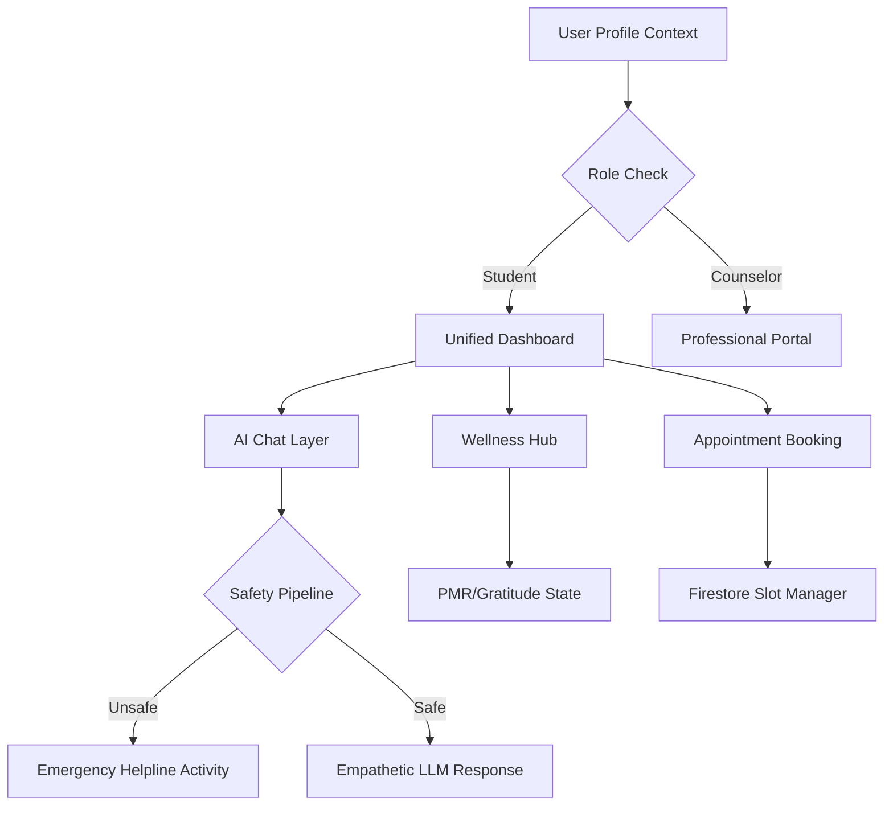

# Research Paper Addition: Application-Based Algorithms & Implementation Workflows

Below are the formalized implementation workflows and orchestrated algorithms for the **ManoMitra** application. These focus on **System Integration**, **Service Logic**, and **User Lifecycle Management**, transitioning from a pure theoretical model approach to a practical application implementation approach.

---

### **Algorithm 1: Safety-First Implementation Workflow (SFAIW)**
*Type: Transactional Logic & Emergency Interception*

**Objective**: To implement a robust safety-gate within the Android application lifecycle that intercepts user content and steers the UI toward crisis resources without delay.

**Input**: User interaction event $E$ (Captured via `EditText` or `MediaRecorder`).  
**Output**: UI State Transition $\in \{\text{Standard_Dialogue}, \text{Crisis_Intervention}\}$.

1.  **Input Capturing**: The application captures the user payload and strips non-essential metadata.
2.  **Synchronous Safety Evaluation**:
    - The `SafetyManager` component loads the quantized **TFLite model** into local memory for sub-millisecond inference.
    - **Logic**: If the text matches high-risk keyword masks (Fail-safe) OR the Neural Risk Score > 0.5:
        - Set `SystemState = CRISIS`.
3.  **UI State Steering (Implementation)**:
    - **Standard Path**: If `SystemState == SAFE`, the app initializes an asynchronous `OkHttp` request to the LLM backend.
    - **Intervention Path**: If `SystemState == CRISIS`, the app executes the following implementation steps:
        - `Intent.clearStack()`: Prevents the user from navigating back to the AI chat to ensure safety.
        - `startActivity(HelplineActivity.class)`: Forces a UI transition to the verified resources page.
        - `HapticFeedback.trigger()`: Provides a physical tactile warning to the user.
4.  **Logging & Persistence**: The crisis event is logged to the local database with a timestamp for subsequent counselor review during professional sessions.

---

### **Algorithm 2: Multi-Role Service Integration & State Orchestration (MSISO)**
*Type: Ecosystem Navigation & Data Synchronization*

**Objective**: To manage the seamless transition of users between diverse mental health modules (Chat, Counseling, Wellness) while maintaining a persistent application state.

**Input**: User Role $R$, Navigation Intent $I$, Feature Selection $F$.  
**Output**: Synchronized Dashboard State and Module Activation.

1.  **Role Verification (Backend Integration)**:
    - On application launch, a listener is attached to the **Firebase Firestore** `users/{uid}` path.
    - The system adjudicates the UI layout based on documented roles: `Student`, `Counselor`, or `Admin`.
2.  **Service Dispatch Logic**:
    - Depending on the user's selection $F$ in the **Unified Dashboard**:
        - **Wellness Dispatch**: Initializes the `RelaxActivity` which manages local state for the PMR (Progressive Muscle Relaxation) timer and Gratitude Journaling content.
        - **Booking Dispatch**: Triggers the `AppointmentScheduling` workflow, executing a Firestore transaction to ensure atomic slot reservation (preventing double-booking).
        - **Chat Dispatch**: Activates the `ChatbotActivity`, establishing a synchronized WebSocket or Long-Polling connection for real-time empathetic support.
3.  **State Persistence & Caching**:
    - Implement a **Fast-Path Cache** using `SharedPreferences` to ensure localized features (like "Last Relaxed Date" or "Selected Theme") persist across app restarts without requiring a network round-trip.
4.  **Feedback Loop**: Upon completion of any module $F$, the app updates the "User Wellness Index" in the cloud to provide long-term progress analytics in the Administrative portal.

---

### **Implementation Diagram: Application Flow Context**
In an application-based paper, the following system-level interaction logic bridge serves as the bridge between modular components:

